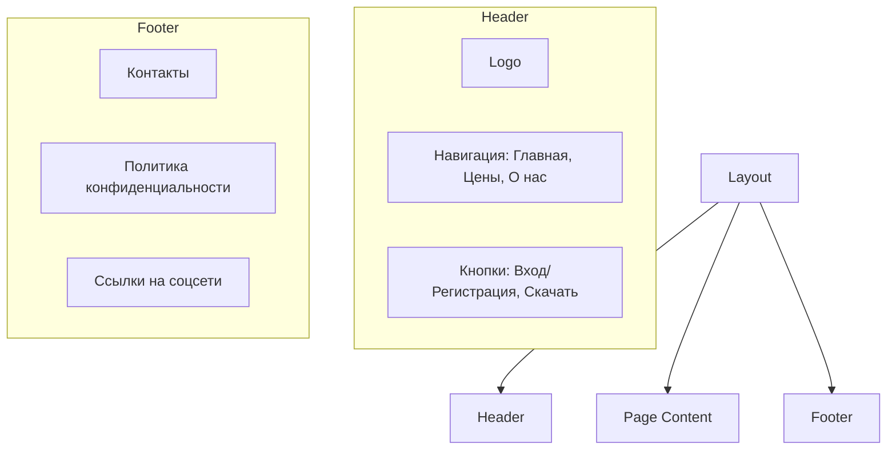
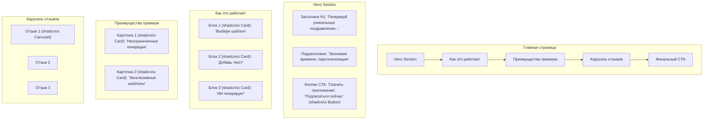
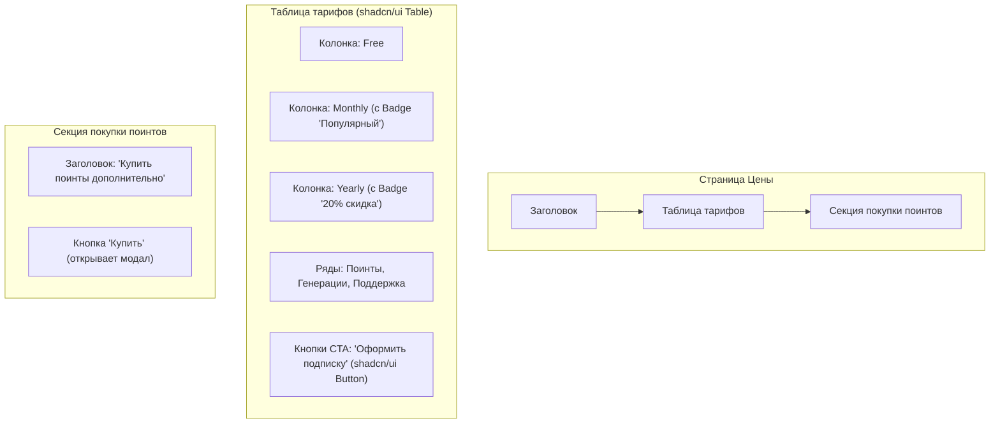

# Дизайн-макеты и структура Frontend

Этот документ описывает визуальную структуру и компоненты веб-интерфейса, которые будут использоваться при разработке. Макеты представлены в виде Mermaid-диаграмм и текстовых описаний, основанных на `docs/requirements-frontend.md` и библиотеке компонентов `shadcn/ui`.

## 1. Общая структура (Layout)



- **Header**: Постоянный элемент на всех страницах. Использует `shadcn/ui DropdownMenu` для мобильных устройств.
- **Footer**: Постоянный элемент. Использует `shadcn/ui Card`.

## 2. Главная страница (Лендинг)


**Описание:**
- **Hero Section**: Первый экран, привлекающий внимание. Используются компоненты `Typography` и `Button` из `shadcn/ui`.
- **Как это работает**: Секция из трех `Card`, объясняющая процесс использования приложения.
- **Преимущества премиум**: Два `Card` с описанием платных функций.
- **Карусель отзывов**: Динамический блок с отзывами, используется `Carousel` из `shadcn/ui`.

## 3. Страница "Цены" (Pricing)


**Описание:**
- **Таблица тарифов**: Используется `Table` и `Badge` из `shadcn/ui` для наглядного сравнения.
- **Покупка поинтов**: Кнопка, открывающая модальное окно (`Dialog`) с пакетами поинтов.

## 4. Личный кабинет (Dashboard)

```mermaid
graph TD
    subgraph "Личный кабинет"
        A[Навигация (Sidebar)] --> B[Контентная часть];
    end

    subgraph "Навигация (shadcn/ui Tabs)"
        A1[Профиль]
        A2[Подписка]
        A3[Поинты]
        A4[История]
        A5[Выход]
    end

    subgraph "Контентная часть (Профиль)"
        B1["Обзор (shadcn/ui Card): Аватар, Баланс, Статус подписки (Badge)"]
    end

    subgraph "Контентная часть (Подписка)"
        B2["Детали (shadcn/ui Card): План, Даты, Кнопки 'Отменить'/'Продлить'"]
    end

    subgraph "Контентная часть (Поинты)"
        B3["График расхода (shadcn/ui Chart), Кнопка 'Купить' (Dialog)"]
    end

    subgraph "Контентная часть (История)"
        B4["Таблица транзакций (shadcn/ui Table)"]
    end
```
**Описание:**
- **Навигация**: Вертикальные вкладки `Tabs` для переключения между разделами.
- **Разделы**: Каждый раздел представлен в виде `Card` с соответствующей информацией и элементами управления (`Button`, `Dialog`, `Table`, `Badge`).

Этот документ послужит основой для frontend-разработки. Он определяет ключевые экраны и используемые компоненты.